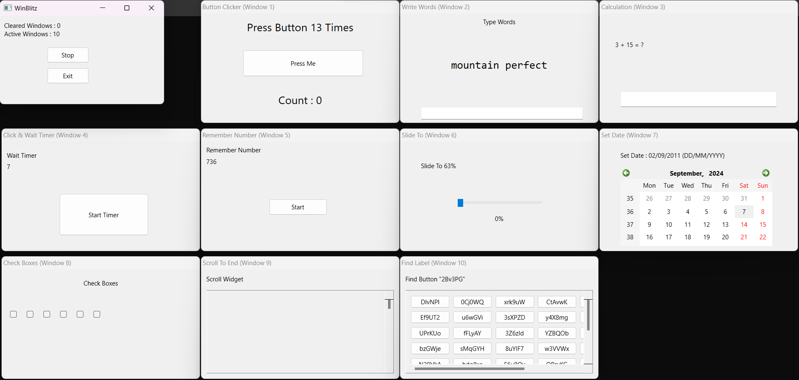

# WinBlitz

[**WinBlitz**](https://github.com/PyroWilDx/WinBlitz/) is an endless survival game where players face a constant stream of windows with various tasks that appear on the screen. To prevent being overwhelmed by these windows, players must complete the tasks quickly and efficiently.

## Download

|  |
|---|

## Development Set-Up

|  |  |  |
|---|---|---|

### How To Use

- Run w/ Qt.

---

  Copyright &#169; 2024 PyroWilDx. All Rights Reserved.

